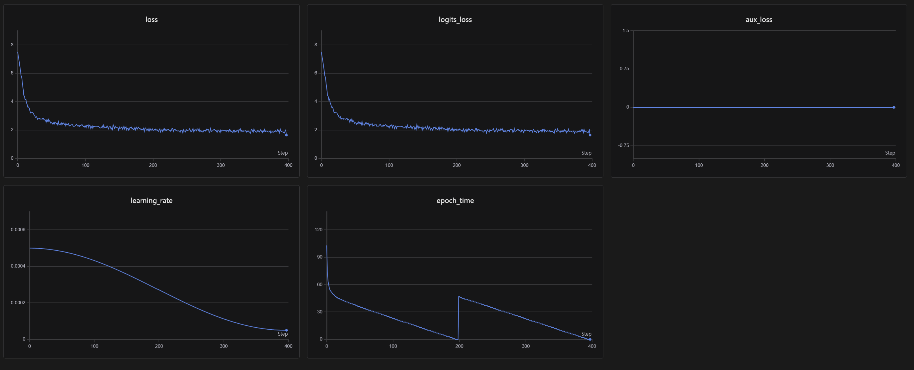
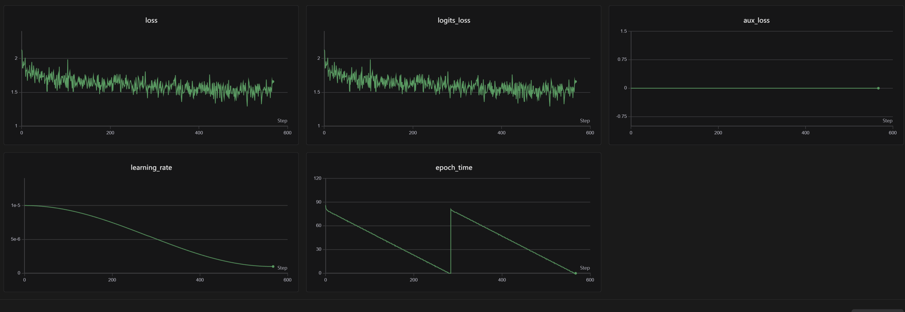
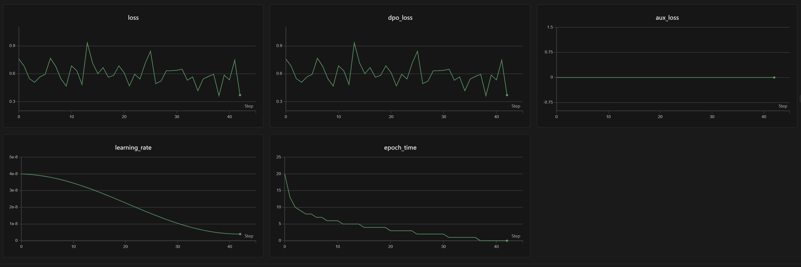
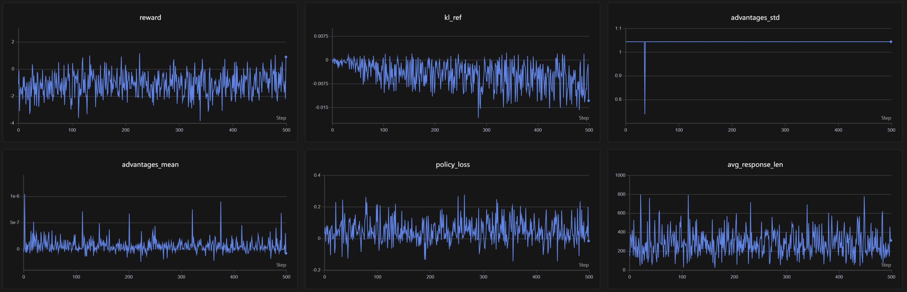

# MiniMind-KDA

在 **[MiniMind](https://github.com/jingyaogong/minimind)**（64M 参数中文小模型，Apache 2.0）的基础上，
把 8 层中的 6 层标准注意力替换为 **Kimi Delta Attention（KDA）**——Kimi Linear 论文
（[arXiv:2510.26692](https://arxiv.org/abs/2510.26692)）提出的 3:1 混合线性注意力架构。

完整打通 **预训练 → SFT → DPO → GRPO** 四阶段训练流程与 CEVAL/CMMLU 评测链路，支持单卡 / DDP 多卡、
混合精度（bf16/fp16）、梯度累积、断点续训与 swanlab 训练曲线。

---

## 项目来源与致谢

> 本项目是 **[MiniMind](https://github.com/jingyaogong/minimind)** 的二次开发版本，
> 遵循上游 Apache 2.0 许可证。感谢原作者 [@jingyaogong](https://github.com/jingyaogong)
> 开源的极简 LLM 训练项目。

**沿用上游的部分**（保持结构与行为一致，以便权重互通）：

- 整体模型结构：RMSNorm 预归一化、RoPE 位置编码（YaRN 外推）、SwiGLU FFN、GQA、可选 MoE、权重绑定；
- 分词器（vocab 6400）与 chat template、四个阶段的数据格式与数据集类设计；
- 训练配方（各阶段超参）与四阶段流程的总体设计；
- 权重命名规则与分布式训练、断点续训的实现思路。

**本项目新增 / 改造的部分**：

- `model/model_kda.py`：Kimi Delta Attention 的完整实现——DPLR 树形并行扫描核心、
  逐 token 顺序参考实现（用于数值对拍）、因果短卷积、RMSNorm + sigmoid 输出门，
  并打通 fla 官方融合内核与纯 PyTorch 内核回退两条路径；
- 把 8 层中的 6 层注意力替换为 KDA（Kimi Linear 3:1 混合架构），打通配置、层布局、
  权重命名、混合 KV cache 与增量解码全链路；
- 训练 / 评测脚本按四阶段流程重新整理并逐行注释，补充 convert → lm-eval 的评测链路。

原始项目：[https://github.com/jingyaogong/minimind](https://github.com/jingyaogong/minimind)　|　
许可证：[Apache 2.0](LICENSE)

## 目录结构

```
MiniMind-KDA/
├── model/
│   ├── model_minimind.py         # MiniMind 主体：config / RMSNorm / RoPE / Attention / FFN / MoE / 因果LM
│   ├── model_kda.py              # Kimi Delta Attention 实现（分块并行核心 + 顺序参考实现）
│   ├── tokenizer.json            # BPE 分词器（vocab 6400）
│   └── tokenizer_config.json     # 分词器配置（含 chat template，支持 tools / thinking）
├── dataset/
│   ├── lm_dataset.py             # 四个阶段的数据集类
│   └── *.jsonl                   # 训练数据（约 3GB，不随仓库分发，见「数据准备」）
├── trainer/
│   ├── train_pretrain.py         # 阶段 1：预训练
│   ├── train_full_sft.py         # 阶段 2：全参 SFT
│   ├── train_dpo.py              # 阶段 3：DPO 偏好对齐
│   ├── train_grpo.py             # 阶段 4：GRPO 强化学习
│   ├── trainer_utils.py          # 公共工具：分布式 / checkpoint / 奖励模型封装
│   └── rollout_engine.py         # GRPO 采样引擎（PyTorch / SGLang）
├── scripts/
│   └── convert_model.py          # torch 权重 → transformers 格式（lm-eval 评测用）
├── eval_llm.py                   # 模型推理与对话测试（自动测试题 / 手动多轮）
├── results/                      # CEVAL/CMMLU 原始评测日志
├── images/                       # 四阶段训练曲线截图
├── out/                          # 训练产出权重（{阶段}_{hidden}[_moe][_attn].pth，运行时生成）
├── checkpoints/                  # 完整续训状态（optimizer / scheduler / step，运行时生成）
├── requirements.txt
└── LICENSE                       # Apache 2.0
```

## 数据准备

仓库不含训练数据（四个 jsonl 共约 3GB，超出 GitHub 单文件限制），请下载后放入 `dataset/`：

| 文件 | 用途 | 说明 |
|---|---|---|
| `pretrain_t2t_mini.jsonl` | 预训练 | 每行 `{"text": "..."}` |
| `sft_t2t_mini.jsonl` | SFT | 每行 `{"conversations": [...]}` |
| `dpo.jsonl` | DPO | 每行 `{"chosen": [...], "rejected": [...]}` |
| `rlaif.jsonl` | GRPO | 每行 `{"conversations": [...]}` |

数据来源（MiniMind 官方数据集）：

- ModelScope：<https://www.modelscope.cn/datasets/gongjy/minimind_dataset/files>
- HuggingFace：<https://huggingface.co/datasets/jingyaogong/minimind_dataset/tree/main>

```bash
# 以 modelscope 为例（国内网络推荐）
pip install modelscope
modelscope download --dataset gongjy/minimind_dataset pretrain_t2t_mini.jsonl --local_dir ./dataset
modelscope download --dataset gongjy/minimind_dataset sft_t2t_mini.jsonl    --local_dir ./dataset
```

## 模型结构

- **规模**：hidden 768 / 8 层 / 8 头 / head_dim 96，约 64M 参数（hybrid +8%）
- **组件**：RMSNorm（Pre-Norm）、RoPE 位置编码（支持 YaRN 外推）、SwiGLU FFN、
  GQA（Q 头 : KV 头 = 2 : 1）、可选 MoE、权重绑定（embedding = lm_head）
- **注意力架构**（`attn_type`，本项目的核心改动）：

| attn_type | 布局 | 说明 |
|---|---|---|
| `softmax` | 8/8 全注意力 | 原始 MiniMind 基线 |
| `hybrid`  | 第 0,1,2,4,5,6 层 KDA + 第 3,7 层全注意力 | Kimi Linear 3:1 混合（默认） |
| `kda`     | 8/8 KDA | 纯线性注意力 |

## KDA 是什么

KDA（Kimi Delta Attention）是一种线性注意力：用**固定大小的状态矩阵**递推代替
softmax 注意力的显式 KV 缓存，每个头每步：

```
S_t = (I - β_t k_t k_tᵀ) · Diag(α_t) · S_{t-1} + β_t k_t v_tᵀ     # delta 规则：先擦后写
o_t = q_tᵀ S_t
α_t = exp(g_t)，g_t = -exp(A_log) · softplus(f_proj(x_t) + dt_bias)   # 细粒度对数衰减门
β_t = sigmoid(b_proj(x_t))                                            # 标量写入门
```

- 复杂度 O(T)，显存不随序列增长，适合长上下文；
- 实现分两套：`kda_core_sequential`（逐 token 递推，数学定义本体，用于对拍）与
  `kda_core_chunked`（DPLR 树形并行扫描 + 逐块梯度检查点，训练路径）；
- 训练优先走 [flash-linear-attention](https://github.com/fla-org/flash-linear-attention)
  官方 `chunk_kda` 融合内核，未安装时自动回退纯 PyTorch 内核（CPU 可跑）。

## 实验结果

受控对比：**相同数据、相同训练配方，只改变注意力结构**（AutoDL RTX 5090 32GB，
lm-evaluation-harness，0-shot，`--apply_chat_template`）。

| 任务 | softmax 基线（8/8 全注意力） | KDA hybrid（6/8 层 KDA） | 差值 | 上游 64M 参考 |
|---|---|---|---|---|
| CEVAL-valid | 20.65% ±1.10 | **23.11%** ±1.15 | **+2.46** | 24.89% |
| CMMLU | 24.49% ±0.40 | **25.09%** ±0.40 | **+0.60** | 25.38% |

原始评测日志（完整逐科目结果）：[results/eval_hybrid.txt](results/eval_hybrid.txt)、
[results/eval_softmax.txt](results/eval_softmax.txt)

**结论与公平性说明**（避免过度解读）：

1. 结论表述为"**持平或略优、无能力损失**"，而非"显著超越"——64M 规模下这些选择题基准
   已接近随机线（25%），CEVAL 的差距约 ±1.5σ，CMMLU 的差距落在噪声范围内；
2. hybrid 参数量比 softmax 多约 8%（63.9M → 69.3M，多出低秩门控网络、ShortConv、A_log/dt_bias），
   并非等参数对比；
3. 两次预训练的 batch size 不完全一致（hybrid 用 64、softmax 基线用 32），步数与余弦调度略有差异；
4. 两个模型都只在 mini 数据集上训练，上游 64M 参考值使用完整语料，仅作外部标尺、不作严格对照。

评测复现命令见下文「模型评测」章节。

## 四阶段训练流程

统一约定：

- 命令在 `trainer/` 目录下运行；
- 模型配置（`hidden_size` / 层数 / `attn_type` / `kda_interval`）在四个阶段必须保持一致；
- 每个阶段的超参默认值已经写成"开箱即用"的推荐配方（见下方《各阶段默认配方》），
  因此命令里只显式写**实验变量**和**阶段间衔接**相关的参数：
  `--attn_type/--kda_interval` 是对比实验的自变量，写出来是为了让配方一目了然
  （换成 `--attn_type softmax` 即得到同配方的全注意力基线）；
  其余参数留空即使用默认值。完整参数列表见 `python train_xxx.py --help`。

### 阶段 1：预训练

```bash
cd trainer
python train_pretrain.py --attn_type hybrid --kda_interval 4 --use_wandb
# 产出 out/pretrain_768_hybrid.pth
```

### 阶段 2：全参 SFT

```bash
python train_full_sft.py --attn_type hybrid --kda_interval 4 --use_wandb
# 产出 out/full_sft_768_hybrid.pth
```

### 阶段 3：DPO 偏好对齐

```bash
python train_dpo.py --attn_type hybrid --kda_interval 4 --use_wandb
# 产出 out/dpo_768_hybrid.pth
```

### 阶段 4：GRPO 强化学习

需要一个 reward 模型（例如 `internlm2-1_8b-reward`）：

```bash
python train_grpo.py --attn_type hybrid --kda_interval 4 \
    --reward_model_path ../../internlm2-1_8b-reward --use_wandb
# 产出 out/grpo_768_hybrid.pth
```

### 各阶段默认配方

| 参数 | 预训练 | SFT | DPO | GRPO |
|---|---|---|---|---|
| `epochs` | 2 | 2 | 1 | 1 |
| `batch_size` | 32 | 16 | 4 | 2 |
| `learning_rate` | 5e-4 | 1e-5 | 4e-8 | 3e-7 |
| `accumulation_steps` | 8 | 1 | 1 | 1 |
| `max_seq_len` | 340 | 768 | 1024 | 768（prompt） |
| `data_path` | `pretrain_t2t_mini.jsonl` | `sft_t2t_mini.jsonl` | `dpo.jsonl` | `rlaif.jsonl` |
| `from_weight` | `none` | `pretrain` | `full_sft` | `full_sft` |
| 算法超参 | — | — | `beta=0.15` | `beta=0.1`、`loss_type=cispo`、`num_generations=6`、`max_gen_len=1024`、`thinking_ratio=0.9` |

通用默认值：`hidden_size=768`、`num_hidden_layers=8`、`attn_type=hybrid`、`kda_interval=4`、
`kda_chunk_size=64`、`kda_checkpoint=1`（梯度检查点）、`kda_use_fla=1`（优先 fla 融合内核）、
`dtype=bfloat16`、`save_dir=../out`。

### 其他常用选项

- **对比实验**：`--attn_type softmax` 训练同配方全注意力基线（权重自动加 `_hybrid`
  等后缀，与基线权重互不覆盖）
- **断点续训**：加 `--from_resume 1`（自动恢复 optimizer / scheduler / step）
- **多卡**：`torchrun --nproc_per_node=4 train_pretrain.py ...`
- **KDA 内核**：`--kda_use_fla 0` 强制纯 PyTorch 内核；`--kda_checkpoint 0`
  关闭梯度检查点（省时间但费显存）；`--kda_chunk_size 32` 适配小显存卡
- **GRPO 加速**：`--rollout_engine sglang`（需先启动 SGLang 服务，见 `rollout_engine.py`）

## 训练曲线

四阶段训练过程由 [swanlab](https://swanlab.cn) 记录（以下均为 mini 数据集的实验）：

| 预训练（400 step） | SFT（600 step） |
|---|---|
|  |  |

| DPO（43 step） | GRPO（500 step） |
|---|---|
|  |  |

怎么读这些曲线：

- **预训练 / SFT**：loss 单调下降（预训练 7.0→2.5，SFT 2.2→1.6），
  learning_rate 呈余弦退火、epoch_time 逐 epoch 下降，`aux_loss` 恒为 0（非 MoE 结构）；
- **DPO**：loss 在 0.35~0.9 之间震荡、**没有下降趋势，这属于正常现象**——
  DPO 的 loss 绝对值不直接反映偏好质量（它衡量的是相对参考模型的隐式奖励差），
  且本阶段只训练了 43 step；
- **GRPO**：reward 全程震荡，KL 参考值维持在 ±0.02 以内（策略未明显偏离参考模型），
  生成长度 200~450 且无塌缩趋势；其中 `advantages_std` 因组内标准化而恒定为 ≈1，
  不含趋势信息，仅用于确认 advantage 计算正常。

复现自己的曲线：给训练脚本加上 `--use_wandb` 即可（四个阶段分别建 swanlab 项目）。

## 模型评测

### 对话冒烟测试

训练完先快速验证对话效果（模式 0 自动跑 8 道题并打印 tokens/s，模式 1 手动多轮）：

```bash
python eval_llm.py --weight full_sft --attn_type hybrid          # 自动测试
python eval_llm.py --weight grpo --attn_type hybrid --historys 4 --open_thinking 1  # 手动多轮
```

### CEVAL-valid / CMMLU（lm-evaluation-harness）

评测链路：`convert_model.py` 把 torch 权重转成 transformers 格式 → `lm_eval` 加载打分。

```bash
# 1) 权重转换（在 scripts/ 下运行；hybrid 自动带上 model_kda.py 并改成相对导入，
#    兼容 lm_eval 的 trust_remote_code 加载）
cd scripts
python convert_model.py --weight full_sft --attn_type hybrid --transformers_path ../minimind-3-hybrid
python convert_model.py --weight full_sft --attn_type softmax --transformers_path ../minimind-3-softmax
cd ..

# 2) 安装评测框架
pip install lm-eval

# 3) 评测（两个模型同命令；cmmlu 数据国内网络需本地化，见下方备注）
HF_ENDPOINT=https://hf-mirror.com lm_eval \
  --model hf --model_args pretrained="minimind-3-hybrid",dtype=auto \
  --tasks ceval-valid,cmmlu --batch_size 16 --device cuda \
  --trust_remote_code --apply_chat_template 2>&1 | tee eval_hybrid.log
```

备注：

- softmax 权重转成 Qwen3 结构（生态兼容性好），KDA/hybrid 走原生 MiniMind 结构；
- `--attn_type` 必须与训练该权重时一致，否则权重命名对不上或 KDA 层加载失败；
- CMMLU 数据下载在国内网络下可能失败，可手动下载 `cmmlu_v1_0_1.zip` 并把
  datasets 缓存里 cmmlu.py 的直链替换为本地路径后再跑。

## 权重命名规则

`{save_weight}_{hidden_size}[_moe][_attn].pth`，例如：

- `pretrain_768_hybrid.pth`：hybrid 预训练权重
- `full_sft_768.pth`：softmax 基线 SFT 权重
- 同名 `_resume.pth`：完整续训状态

> KDA/hybrid 权重与上游 MiniMind 的同尺寸 softmax 权重结构不同（多出 KDA 层参数），
> 但同一架构下的权重命名与 state_dict 键与上游保持一致，可互相加载。

## 引用

- MiniMind（上游项目）: <https://github.com/jingyaogong/minimind> （Apache 2.0）
- Kimi Linear / KDA: <https://arxiv.org/abs/2510.26692>
- flash-linear-attention: <https://github.com/fla-org/flash-linear-attention>
